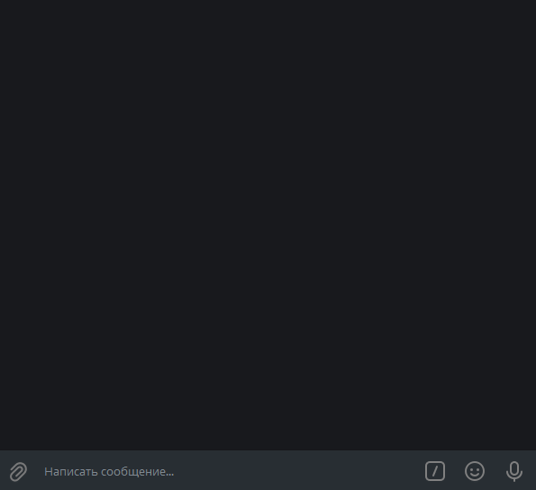

# remote-computer-managmentbot
Paste the necessary data into .env  
AMINS - admins tokens; BOT_TOKEN - bot token; emailLogin - the mail login from which the files will be sent; emailPassword - the mail password from which the files will be sent; defaultEmail - the mail to which the; confirmation code, files, etc. will be sent; defaultDirectory - Directory at startup; smtpServer - SMTP mail; server from which messages will be sent; smtpPort - SMTP mail port from which messages will be sent  
After RENAME .env.dist to .env

